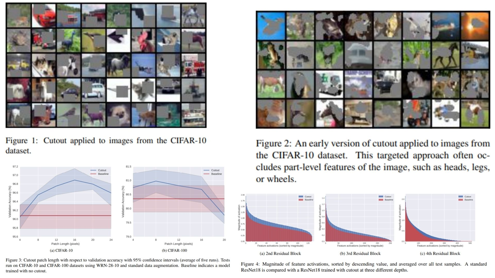

# ⟁ Cutout Replication – Spatial Occlusion as Input-Space Regularization

This repository provides a **PyTorch-based conceptual replication** of  
**Improved Regularization of Convolutional Neural Networks with Cutout**.

The focus is **understanding Cutout as an input-space regularizer**,  
rather than performing full training or reporting benchmark accuracy.

- CNN backbone with **spatially structured occlusion** ⧉  
- Random square masking applied **only at input level** ◻︎  
- Encourages **context-aware feature learning** ⟁  
- Demonstrates theoretical **robustness to occlusion** ⟡  

**Paper reference:** [Improved Regularization of Convolutional Neural Networks with Cutout](https://arxiv.org/abs/1708.04552) 🧩


---

## ⛺ Overview – Cutout Mechanism



### 🌿 High-level Pipeline

**1. Input image**

An RGB image represented as  
```math
X ∈ ℝ^{3 × H × W}
```
---

**2. Random spatial region selection**

A square region of fixed size $$L × L$$ is selected,  
centered at a randomly sampled pixel $$(x, y)$$.

---

**3. Spatial occlusion (Cutout)**

Pixels inside the selected region are masked:  
```math
X' = X ⊙ M 
```
where $$M ∈ {0,1}^{3 × H × W}$$ is a binary mask with zeros inside the cutout region.

---

**4. CNN feature extraction**

The masked image $$X'$$ is forwarded through the CNN backbone, producing  
```math
F^{(l)} = f(W^{(l)} * F^{(l−1)})
```
---

**5. Classification**

Final prediction is obtained as
```math
ŷ = softmax(FC(F^{(L)})).
```
> Since occluded pixels are removed at the input level,  
> their influence disappears from **all subsequent feature maps**.

---

## 🌱 What the Model Demonstrates

- **Spatially structured occlusion**: contiguous regions are removed, not noise ⧉  
- **Input-level regularization**: masking propagates through the network ◻︎  
- **Context reasoning**: model cannot rely on a single discriminative part ⟁  
- **Dropout contrast**: no stochastic activations, only realistic occlusions ⟡  
- **Forward-only design**: conceptual replication without training ⚗︎  

---

## 📦 Repository Structure

```bash
Cutout-Replication/
├── src/
│   ├── layers/
│   │   ├── conv_block.py         # Conv katmanları (Normal + Strided)
│   │   ├── activation.py         # ReLU, GELU vb.
│   │   ├── normalization.py      # BatchNorm / LayerNorm
│   │   └── pooling.py            # Max / Avg pooling
│   │
│   ├── backbone/
│   │   ├── cnn_blocks.py         # Basit CNN blokları (VGG tarzı)
│   │   └── feature_maps.py       # Son conv feature maplerini expose et
│   │
│   ├── model/
│   │   └── cutout_cnn.py         # Main model + Cutout entegrasyonu
│   │
│   ├── cutout/
│   │   └── cutout_layer.py       # Cutout logic (masking)
│   │
│   ├── loss/
│   │   └── cross_entropy.py      # Standart cross-entropy
│   │
│   ├── config.py                 # Hyperparametreler, Cutout size vb.
│   │
│   └── utils.py                  # Dataset preprocessing, helper functions
│
├── images/
│   └── figcut.jpg
│
├── requirements.txt
└── README.md
```

---

## 🔗 Feedback

For questions or feedback, contact: [barkin.adiguzel@gmail.com](mailto:barkin.adiguzel@gmail.com)
